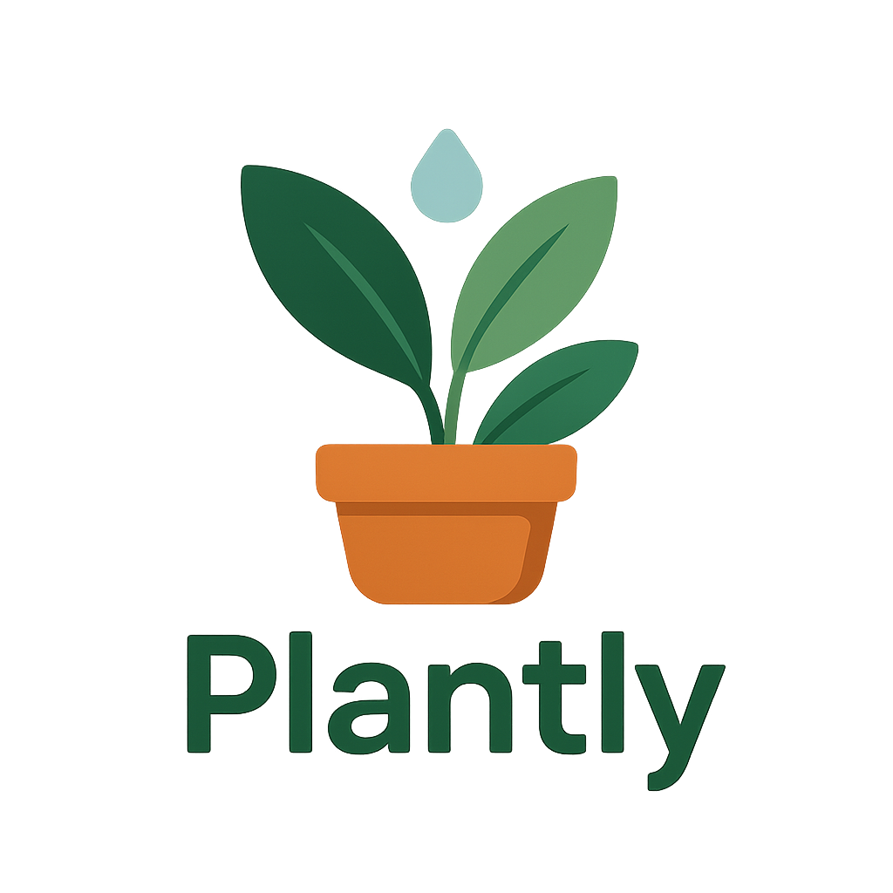

# Plantly Website

Welcome to the official website for **Plantly** – your smart plant care companion!

## About Plantly

Plantly is a mobile app designed to help you identify, track, and nurture your plants. With features like plant species identification, custom watering reminders, and growth tracking, Plantly makes plant care easy and enjoyable.

## Features

- **Plant Identification:** Easily identify plant species.
- **Watering Reminders:** Set custom reminders to keep your plants hydrated.
- **Growth Tracking:** Monitor your plant’s progress over time.

## Website

This site provides a simple way to download the Plantly Android app and learn more about its features.

- **Download the APK:** [Download Plantly](https://github.com/KatekaniN/plantly-website/releases/download/plantly/plantly.apk)
- **Logo:** 

## How to Use

1. Visit `download.html` for a beautiful landing page and download link.
2. Click the "Download APK" button to get the latest version of Plantly for Android.

## License

© 2025 Plantly. All rights reserved.
